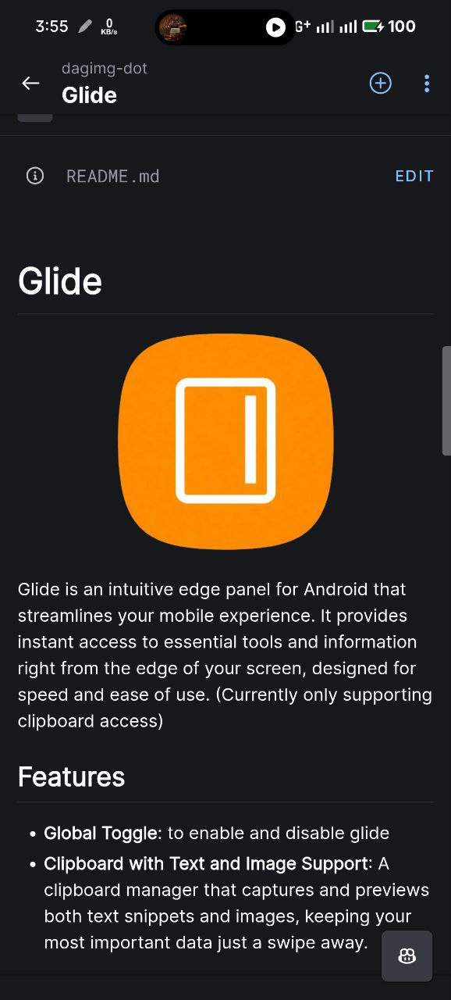
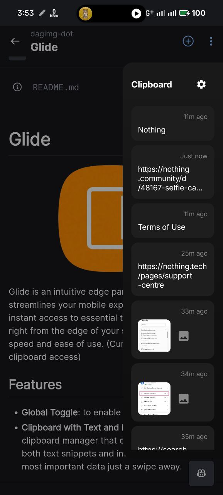

# Glide

  

Glide is an intuitive edge panel for Android that streamlines your mobile experience. It provides instant access to essential tools and information right from the edge of your screen, designed for speed and ease of use. (Currently only supporting clipboard access)

## Features

- **Global Toggle**: to enable and disable glide
- **Clipboard with Text and Image Support**: A clipboard manager that captures and previews both text snippets and images, keeping your most important data just a swipe away.

## Preview

  
  

